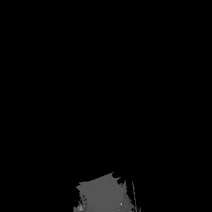

# Vim Teabindings

| Render Name                      | Render                                                                           |
| -------------------------------- | -------------------------------------------------------------------------------- |
| Teacup-Plane                     |                     |
| Teapot Refraction (light behind) |  |
| Frosted Teapot (light in front): |   |
To update these renders, run `make render-test`.